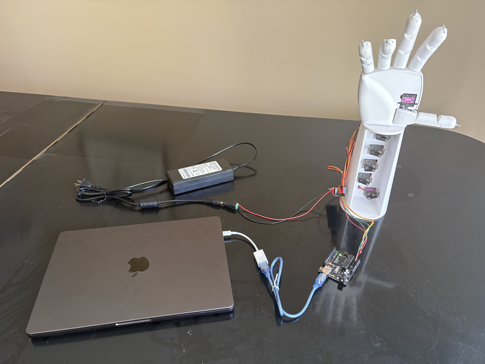
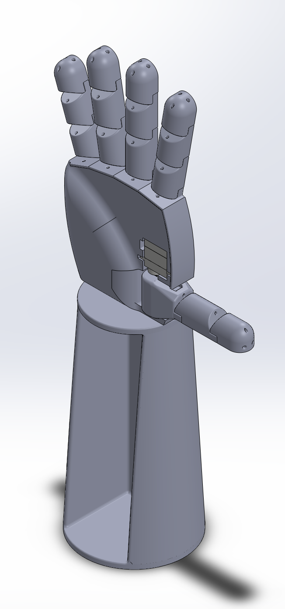
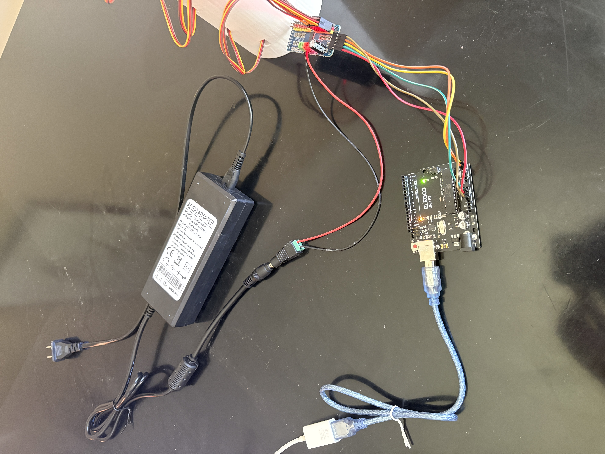
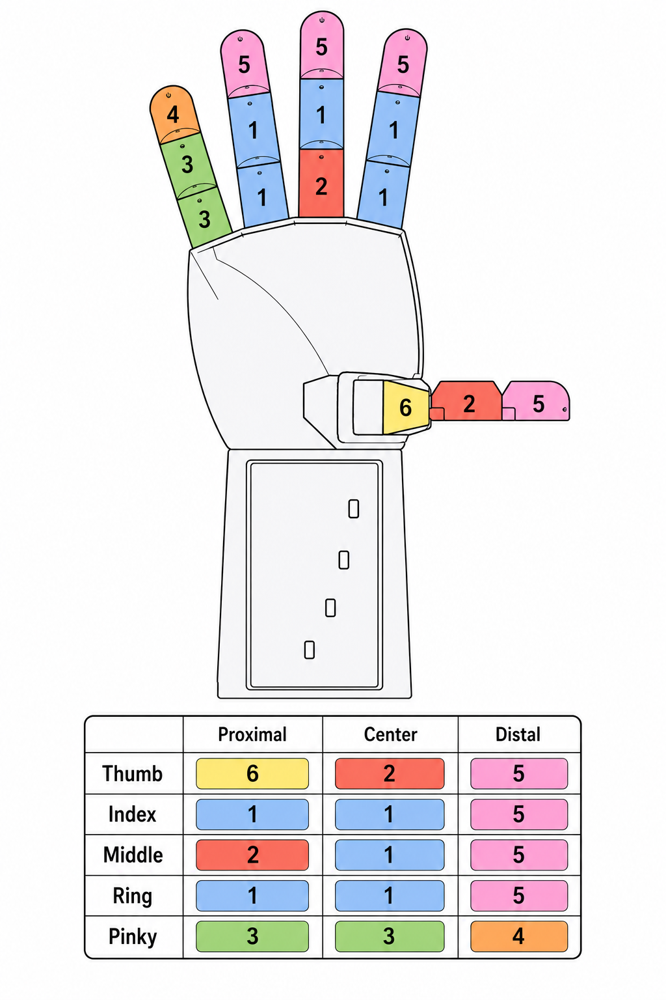

# Computer Vision Controlled Robotic Hand

This project is a 3D-printed tendon-driven robotic hand controlled using real-time computer vision. The project combines SolidWorks CAD design, 3D printing, servo actuation, Arduino control, and Python-based hand tracking

## Demo

**Video:** [Watch the demo video](media/demo.mp4)

[](media/demo.mp4)

Click the image above to open the demo video.

## Overview

The system tracks a human hand using a webcam, estimates finger openness from hand landmarks, and sends servo commands to a robotic hand

```text
Webcam → Python/OpenCV/MediaPipe → Arduino → PCA9685 → Servo motors → Tendons → Robotic hand
```

## Features

- Real-time hand tracking using OpenCV and MediaPipe
- Tendon-driven finger actuation using fishing line
- Elastic extension system for reopening fingers
- Arduino serial control
- PCA9685 16-channel servo driver
- Custom SolidWorks CAD design
- Servo calibration script for finding safe open and closed pulse values
- 3D-printable STL files included

## Project Images

### CAD Render



### Electrical Setup



## Hardware

Main hardware used:

- Arduino Uno
- PCA9685 16-channel servo driver
- MG90S micro servo motors
- 5V 10A external power supply
- Fishing line for tendons
- Elastic cord / rubber bands for finger return
- 3D-printed hand parts
- Webcam or laptop camera

More details are in [`docs/BOM.md`](docs/BOM.md).

## Software

The main software is located in [`software/python`](software/python).

Important files:

| File                      | Purpose                              |
| ------------------------- | ------------------------------------ |
| `vision_servo_control.py` | Main computer vision control script  |
| `servo_calibration.py`    | Interactive servo calibration script |
| `requirements.txt`        | Python dependencies                  |

The Arduino sketch is located in:

```text
software/arduino/robotic_hand_serial_controller/
```

## CAD Files

The CAD files are located in [`cad`](cad).

| Folder/File                         | Purpose                            |
| ----------------------------------- | ---------------------------------- |
| `cad/Full Robotic Hand.SLDASM`      | Main SolidWorks assembly           |
| `cad/Parts/`                        | Editable SolidWorks part files     |
| `cad/Printing Files/`               | Exported STL files for 3D printing |
| `cad/diagrams/hand-segment-map.png` | Finger segment reference map       |

## Finger Segment Map



## Wiring

Wiring details are documented in [`docs/wiring.md`](docs/wiring.md).

Servo channel map:

| PCA9685 Channel | Servo          |
| --------------: | -------------- |
|               0 | Thumb rotation |
|               1 | Thumb curl     |
|               2 | Index          |
|               3 | Middle         |
|               4 | Ring           |
|               5 | Pinky          |

## Running the Project

### 1. Install Python dependencies

From the project root:

```bash
cd software/python
python3 -m venv .venv
source .venv/bin/activate
pip install -r requirements.txt
```

### 2. Upload the Arduino sketch

Open this sketch in Arduino IDE:

```text
software/arduino/robotic_hand_serial_controller/robotic_hand_serial_controller.ino
```

Upload it to the Arduino Uno.

### 3. Check the Arduino port

On macOS, run:

```bash
ls /dev/cu.*
```

Update the `PORT` value in the Python scripts if needed.

Example:

```python
PORT = "/dev/cu.usbmodem3101"
```

### 4. Calibrate servos

Run:

```bash
python3 servo_calibration.py
```

Use this script to manually find the safe open and closed pulse values for each servo.

### 5. Run vision control

Run:

```bash
python3 vision_servo_control.py
```

Press `q` to quit.

## Calibration Notes

Each servo has custom open and closed pulse values because the mechanical range, servo orientation, tendon tension, and tendon routing vary between fingers.

The calibration script saves local calibration values to:

```text
servo_calibration.json
```

This file is ignored by Git because it is specific to the local mechanical setup.
